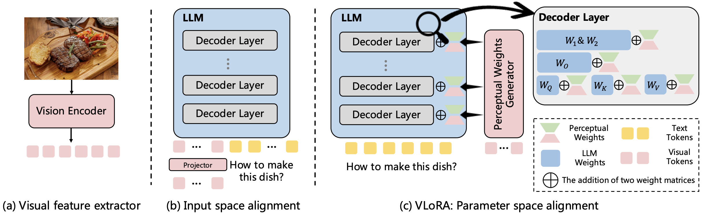
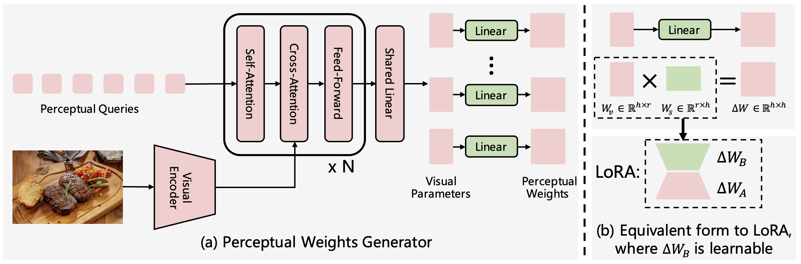

<div align="center">
<br>
<h3>Visual Perception by Large Language Model's Weights</h3>

Feipeng Ma<sup>1,2</sup>, Hongwei Xue<sup>1,2,3</sup>, Yizhou Zhou<sup>2</sup>, Guangting Wang<sup>2</sup>, Fengyun Rao<sup>2</sup>, <br>Shilin Yan<sup>4</sup>, Yueyi Zhang<sup>1</sup>, Siying Wu<sup>1</sup>, Mike Zheng Shou<sup>3</sup>, Xiaoyan Sun<sup>1</sup>

<sup>1</sup>University of Science and Technology of China <sup>2</sup>WeChat, Tencent Inc. <br> <sup>3</sup>Show Lab, National University of Singapore <sup>4</sup>Fudan University


<p align="center">
  <a href='https://arxiv.org/abs/2405.20339'>
    
  </a>
  <a href='https://arxiv.org/pdf/2405.20339'>
    
  </a>
  <a href='https://feipengma6.github.io/vlora'>
  </a>
</p>
</div>

>💡💡💡
> We propose **💡a novel parameter space alignment paradigm** for MLLMs to address the inefficiency of input space alignment paradigm in visual perception, introducing VLoRA that **💡converts visual features to LoRA weights**, **💡achieving comparable performance** on various benchmarks while **💡significantly reducing computational costs for training and inference**.


**News**
* **[2024-10-02]**  Code and model are released.
* **[2024-09-26]**  VLoRA is accepted by **NeurIPS 2024**.

## Overview
**1. A Novel Parameter Space Alignment Paradigm**
<p align="center">

</p>

Recent MLLMs follow an **input space alignment paradigm** that aligns visual features with the input space of LLM and concatenates visual tokens with text tokens to form a unified sequence as input for LLM. This can result in computational inefficiency for both training and inference. 
To address this issue, we explore a novel **parameter space alignment paradigm** where visual information is represented as LLM’s weights. As shown in the above figure, we design perceptual weights generator to convert visual feature to LoRA weights and merge them into LLM, eliminating the need for visual tokens in the LLM’s input and significantly improving efficiency for training and inference.


**2. Perceptual Weights Generator**
<p align="center">

</p>
This figure illustrates the details of our perceptual weights
generator. We set $k$ learnable perceptual queries, which interact with image features in $N$ decoder
blocks, and obtain $k$ visual parameters. Then, a shared linear layer and $k$ independent linear layers are used to convert these visual parameters to perceptual weights $\Delta W$. The left figure demonstrates that our approach is formally consistent with LoRA.

## Models
We upload the checkpoint of VLoRA to huggingface, you can access [VLoRA-7b-v1](https://huggingface.co/feipengma/VLoRA-7b-v1) for inference.


## Getting Started
#### 1. Prepare environment
We provide dockerfile to help you build a runnable environment. If you prefer using pip, you can use the following command to install necessary packages.
```bash
pip3 install -r requirements.txt
pip3 install flash-attn --no-build-isolation
```
#### 2. Prepare training data

**Pre-training data**
During pre-training, we use image-text pairs to train VLoRA. Specifically, we use a subset of [CapsFusion-120M](https://huggingface.co/datasets/BAAI/CapsFusion-120M) with 30M image-text pairs. You should download [CapsFusion-120M](https://huggingface.co/datasets/BAAI/CapsFusion-120M) and sample 30M image-text pairs. The format of data should be same as [LLaVA](https://huggingface.co/datasets/liuhaotian/LLaVA-Pretrain).

**Fine-tuning data**
For supervised fine-tuning, we adopt the same data as LLaVA-v1.5. Specifically, the supervised fine-tuning data is constructed with VQAv2, GQA, OKVQA, OCRVQA, A-OKVQA, TextCaps, RefCOCO, Visual Genome, ShareGPT, and LLaVA-Insturct, with a total of 665K conversation data.
You can follow [LLaVA](https://github.com/haotian-liu/LLaVA?tab=readme-ov-file#visual-instruction-tuning) to prepare instruction-tuning data.

#### 3. Training
**Pre-training**
The following table shows the hyperparameter for pre-training.

|Global Batch Size|Learning rate|Epochs|Max length|Weight decay|
| :---: |:---:|:---:|:---:|:---:|
|768| 5e-5| 1| 2048| 0|

You can run pre-training using `scripts/pretrain.sh`. Please set the `data_path` and `image_folder` according to your data path. The default `output_dir` is `checkpoints/vlora-7b-pretrain`.
```bash
bash scripts/pretrain.sh
```
On the 8xH800, the pre-training stage will cost around 120 hours.

**Fine-tuning**
The following table shows the hyperparameter for fine-tuning.
|Global Batch Size|Learning rate|Epochs|Max length|Weight decay|
| :---: |:---:|:---:|:---:|:---:|
|128| 2e-5| 1| 2048| 0|

You can use following command to start fine-tuning model. The checkpoint will be saved at `checkpoints/vlora-7b-sft`.
```bash
bash scripts/finetune.sh
```
The fine-tuning stage is conducted on 8xH800 within 2.5 hours.

#### 4. Inference
We provide a simple script for inference with a single image input.
```bash
python3 llava/test_generate.py --model_path ./checkpoints/vlora-7b-sft --image_path ./images/dino.png --question "Please describe this image."
```

#### 5. Evaluation
We use [VLMEvalKit](https://github.com/open-compass/VLMEvalKit) to evaluate the model.
|Model| MMBench | MME |ScienceQA|HallusionBench| MMMU | CCBench|
| :---: |:---:|:---:|:---:|:---:|:---:|:---:|
|MiniGPT-4-v2|24.3| 708.4| 54.1| 30.0| 25.0| 1.4|
|Idefics-instruct|48.2| 942| 51.6| 27.3| 18.4| 7.8|
|OpenFlamingo v2 |6.6| 535| 45.7| 29.4| 28.2| 6.3|
|Qwen-VL-Chat |60.6 |1467.8 |65.5| 36.8| 37.0| 41.2|
|LLaVA-v1.5-7b| 64.3| 1510.7| 66.8 | 27.6 | 35.7 | 27.5 | 
|vlora-v1-7b| 63.4 | 1311.3 | 66.4 | 26.4 | 33.7 | 28.6 | 


## Acknowledgments
This codebase is built upon [LLaVA](https://github.com/haotian-liu/LLaVA). 
Thanks for their outstanding work!

## Citation
If you find VLoRA is useful for your research, please cite us:
```
@article{ma2024visual,
  title={Visual Perception by Large Language Model's Weights},
  author={Ma, Feipeng and Xue, Hongwei and Zhou, Yizhou and Wang, Guangting and Rao, Fengyun and Yan, Shilin and Zhang, Yueyi and Wu, Siying and Shou, Mike Zheng and Sun, Xiaoyan},
  journal={arXiv preprint arXiv:2405.20339},
  year={2024}
}
```
